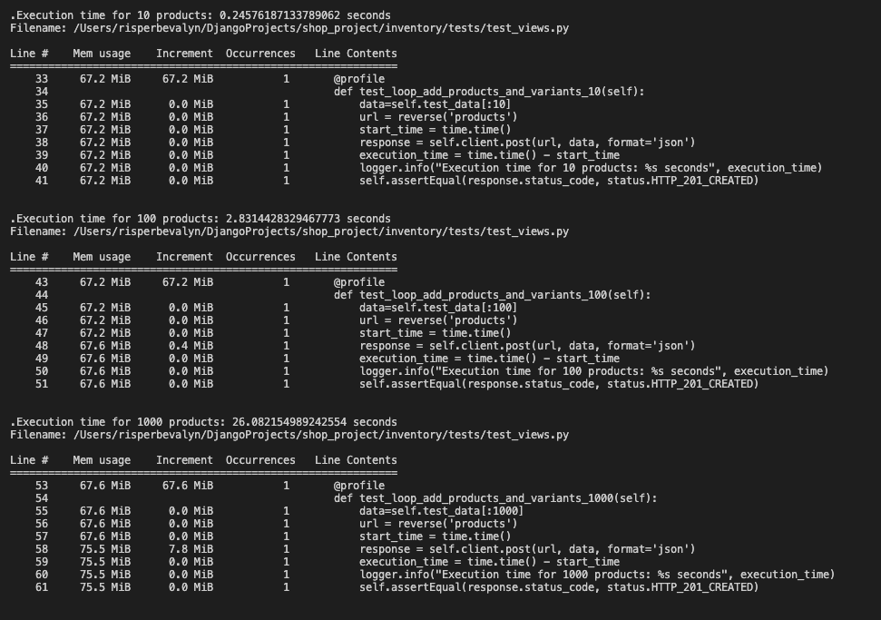
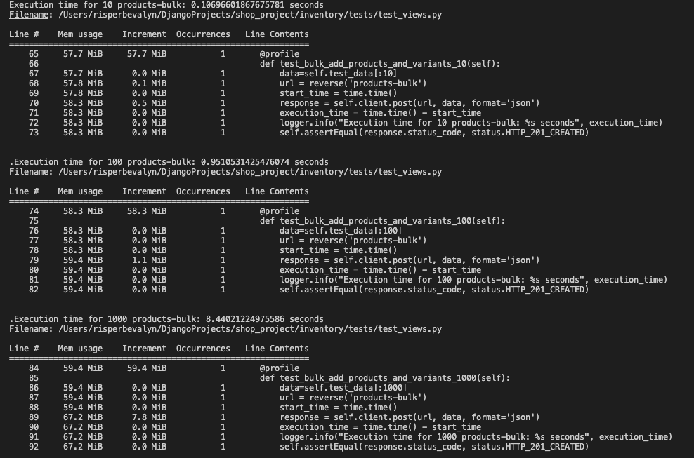

Solution 1: Insert all products and their variants using the create method sequentially.

Solution 2: Insert products and their variants using the bulk create method.

The bulk creation is a more efficient method for large datasets in execution time.
