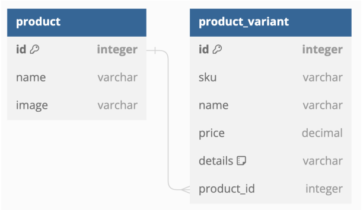

<!DOCTYPE html>
<html lang="en">
<head>
<meta charset="UTF-8">
<meta name="viewport" content="width=device-width, initial-scale=1.0">
<!--<title>README</title>
</head>
<body>

<h1>Installation</h1>
<ol>
<li>Clone the repository:
<pre><code>git clone &lt;repository_url&gt;</code></pre></li>
<li>Run Docker Compose
<pre><code>docker-compose up --build</code></pre></li>
</ol>-->

<h2>Model</h2>

<h2>Endpoints</h2>

Run the application using the following command:

<pre><code>python manage.py runserver</code></pre>
<ul>
<li>Products Endpoint: <a href="http://127.0.0.1:8000/inventory/products">http://127.0.0.1:8000/inventory/products</a></li>
<li>Bulk Products Endpoint: <a href="http://127.0.0.1:8000/inventory/products-bulk">http://127.0.0.1:8000/inventory/products-bulk</a></li>
</ul>

<h2>Tests</h2>

Run tests using the following command:

<pre><code>python manage.py test</code></pre>

<h3>Solution 1: Sequential Insertion</h3>

Insert all products and their variants using the <code>create</code> method sequentially.

Endpoint: <a href="http://127.0.0.1:8000/inventory/products">http://127.0.0.1:8000/inventory/products</a>

Test Results:

<h3>Solution 2: Bulk Insertion</h3>

Insert products and their variants using the <code>bulk_create</code> method.

Endpoint: <a href="http://127.0.0.1:8000/inventory/products-bulk">http://127.0.0.1:8000/inventory/products-bulk</a>

Test Results:

<h2>Analysis:</h2>
<h4>Runtime:</h4>
<ul>
  <li>Blulk Insertion solution has approximately less runtime than the sequential solution. Especially for the larger dataset as seen with the 1000 products the execution time decreased from 26.08s to 8.44s.</li>
</ul>
<h4>memory usage:</h4>
<ul>
  <li>There was a slight increase in memory for the bulk insertion solution compared to the sequential insertion solution</li>
</ul>

Solution 2 Bulk Insertion is the more optimal solution because of faster runtime

</body>
</html>
